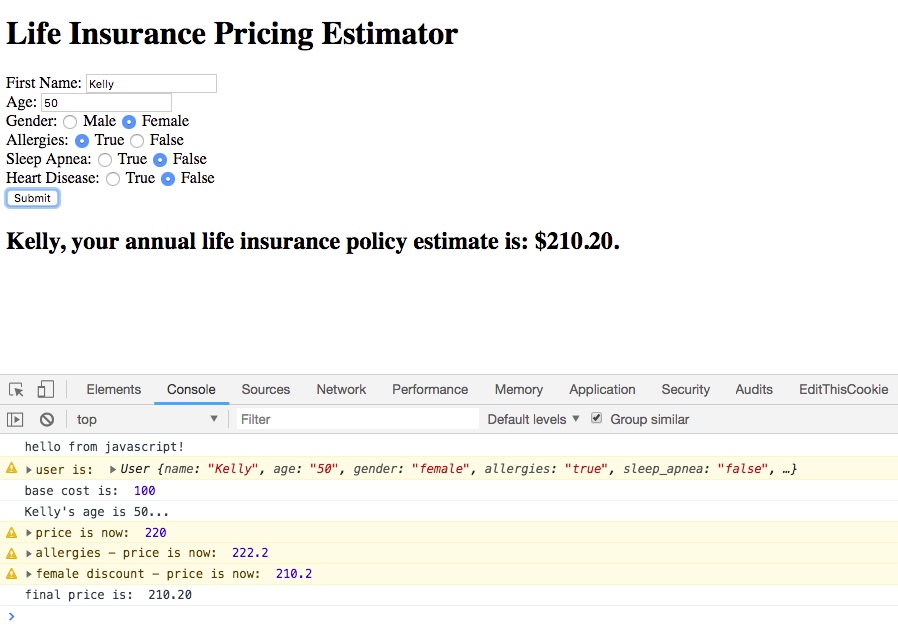

# insurance-pricing

The instructions said building out a UI wasn't necessary, but I couldn't imagine an MVP without a user interface!

My first instinct was to build this in React, or as a full stack Rails and React app, but the instructions said to use a vanilla language, not a framework, and creating a database didn't seem necessary for this MVP. I also considered building this app in vanilla Ruby as a CLI, but ultimately chose to complete this code challenge in vanilla JavaScript, with a simple form in HTML.

My process was:
- building out the UI in HTML
- writing the User class and pricing functionality in JavaScript
- writing the tests

I used Jasmine as a testing framework, to test the User class and the getPrice functionality. I considered adding other classes, like a separate Condition class, or a Price class, but ultimately decided all I needed for this challenge was a User class, which included health conditions as attributes. I handled the pricing with simple functions. When a user fills out and submits the form, an instance of the User class is created, and that user's price estimate is returned.

To view this app in the browser, simply open this folder, doubleclick the index.html file, and open it in the browser.

To view the automated tests, open the testing folder and doubleclick on the InsuranceSpecRunner.html file to view it in the browser.
